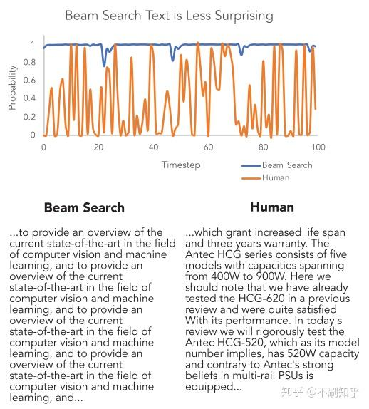
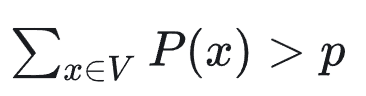

#### 为什么要改进beam search
- 对比给定同样引文的情况下人类续写和机器生成的词用语言模型计算出来的条件概率。
- 如下图所示，人类选择的词（橙线）并不是像机器选择的（蓝线）那样总是那些条件概率最大的词。
- 这些概率大的词会发生正反馈，产生循环。从生成的结果也可以看出，机器生成的结果有大量重复。
- 

### nuclear sampling

- 固定候选集合的概率密度和在整个概率分布中的比例
- 重新归一化集合内词的概率
- 最后从新的概率分布中采样词汇。